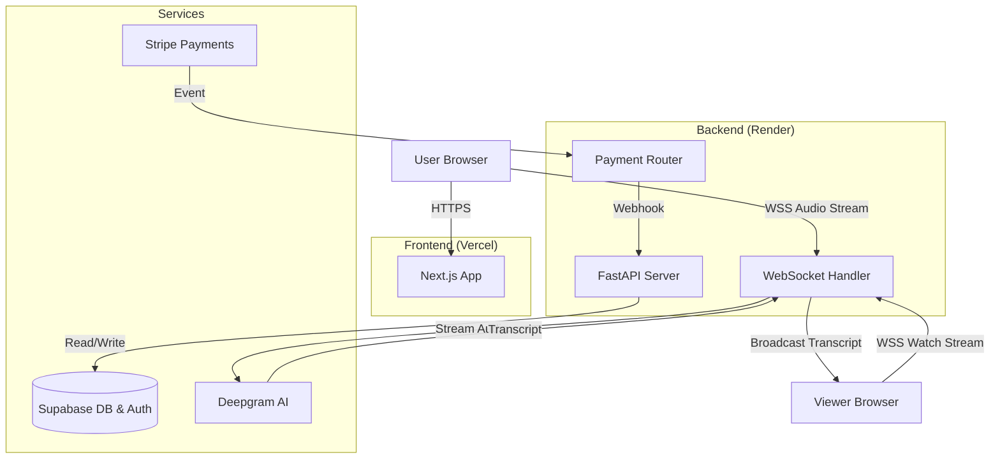

# Verbact: Requirements & Architecture Document

## 1. Executive Summary
**Verbact** is a real-time transcription platform designed to provide instant, accurate, and shareable speech-to-text capabilities. The platform targets professionals, students, and content creators who need reliable transcription with minimal latency. This document outlines the business requirements and technical architecture for the current MVP and future scalable iterations.

---

## 2. Business Requirements Document (BRD)

### 2.1 Core Value Proposition
*   **Speed**: Real-time transcription with sub-second latency.
*   **Accuracy**: High-fidelity transcription using state-of-the-art AI models (Deepgram Nova-2).
*   **Shareability**: Instant "Live Share" links for remote viewing of transcripts as they happen.
*   **Simplicity**: A clean, distraction-free UI focused on the content.

### 2.2 User Personas
1.  **The Professional**: Uses Verbact for meetings and interviews. Needs accuracy and easy sharing.
2.  **The Student**: Uses Verbact for lectures. Needs unlimited recording time and low cost.
3.  **The Creator**: Uses Verbact for captions and content generation. Needs export options.

### 2.3 Functional Requirements (MoSCoW)

#### Must Have (MVP - Completed)
*   **User Authentication**: Sign up/Login via Email (Supabase Auth).
*   **Real-time Transcription**: Streaming audio to text via WebSocket.
*   **Live Sharing**: Generate unique, shareable links for real-time viewing.
*   **Usage Limits**: Enforce time limits based on subscription tier (Free: 10m, Pro: 20h).
*   **Payments**: Stripe integration for subscription upgrades.
*   **Dashboard**: View and manage past recordings.

#### Should Have (Next Steps)
*   **Audio Export**: Download original audio files.
*   **Text Export**: Export transcripts to PDF/Docx/Markdown.
*   **Speaker Diarization**: Identify and label different speakers.
*   **Search**: Full-text search across all transcripts.

#### Could Have (Future)
*   **AI Summarization**: Auto-generate meeting notes and action items (LLM integration).
*   **Team Workspaces**: Shared folders and billing for organizations.
*   **Mobile App**: Native iOS/Android application.

#### Won't Have (For Now)
*   **Video Recording**: Focus remains strictly on audio/text.
*   **On-premise Deployment**: SaaS only for the foreseeable future.

### 2.4 Monetization Strategy
*   **Free Tier**: 10 mins/session. Teaser for core functionality.
*   **Pro Tier ($15/mo)**: 1200 mins/month. Targeted at heavy users.
*   **Unlimited Tier ($30/mo)**: Uncapped usage. For power users/enterprises.

---

## 3. Technical Architecture & Design (TDD)

### 3.1 Current Technology Stack
*   **Frontend**: **Next.js 14 (App Router)**
    *   *Rationale*: Server-side rendering (SSR) for SEO, React Server Components (RSC) for performance, and excellent developer experience.
    *   *Styling*: **Tailwind CSS** for rapid, utility-first design.
*   **Backend**: **FastAPI (Python)**
    *   *Rationale*: High-performance async support (critical for WebSockets), native Pydantic integration for validation, and rich ecosystem for AI/Data libraries.
*   **Database**: **Supabase (PostgreSQL)**
    *   *Rationale*: Managed Postgres with built-in Auth, Row Level Security (RLS), and real-time subscription capabilities.
*   **Transcription Engine**: **Deepgram API**
    *   *Rationale*: Lowest latency and highest accuracy among competitors (vs. OpenAI Whisper, Google STT) for streaming audio.
*   **Payments**: **Stripe**
    *   *Rationale*: Industry standard, robust API, handles tax/compliance.

### 3.2 System Architecture

### 3.3 Scalability & Performance

#### Current Bottlenecks
*   **Single WebSocket Server**: Currently, WebSocket connections are stateful on a single server instance. If we scale to multiple backend instances, a user connected to Server A cannot "live share" to a viewer connected to Server B without a message broker.

#### Recommended Architecture for Scale
To support thousands of concurrent live sessions, we should introduce **Redis Pub/Sub**:

1.  **Publisher**: The recording session publishes transcripts to a Redis channel (`channel:recording_id`).
2.  **Subscriber**: Viewer sessions subscribe to that Redis channel.
3.  **Statelessness**: This decouples the recorder from the viewer, allowing them to be on different server instances.

### 3.4 Security & Compliance
*   **Authentication**: Handled via Supabase Auth (JWTs).
*   **Authorization**: Row Level Security (RLS) in Postgres ensures users can only access their own data.
*   **Data Privacy**: Transcripts are stored encrypted at rest (Supabase default).
*   **Payments**: PCI compliance handled by Stripe; we never touch raw credit card data.

### 3.5 Best Alternatives & Trade-offs

| Component | Current Choice | Alternative | Trade-off Analysis |
| :--- | :--- | :--- | :--- |
| **Backend** | **FastAPI** | **Node.js (Express)** | Node.js has better WebSocket support in some PaaS, but Python is superior for future AI/ML integration (e.g., local LLM summarization). **Verdict: Stick with Python.** |
| **DB** | **Supabase** | **Firebase** | Firebase is NoSQL (harder for structured relational data like billing/users). Supabase offers SQL + Realtime. **Verdict: Stick with Supabase.** |
| **AI Model** | **Deepgram** | **Whisper (OpenAI)** | Whisper is accurate but slow for *real-time* streaming (high latency). Deepgram is purpose-built for streaming. **Verdict: Stick with Deepgram for Live, consider Whisper for post-processing.** |
| **Hosting** | **Render** | **AWS (ECS/Lambda)** | AWS offers more control but higher complexity. Render is "PaaS" (Platform as a Service) and sufficient for current scale. **Verdict: Move to AWS only when scale dictates cost savings.** |

---

## 4. Future Roadmap (Technical)

### Phase 1: Hardening (Immediate)
*   [ ] **Redis Integration**: Implement Redis Pub/Sub for scalable WebSockets.
*   [ ] **Error Recovery**: robust reconnection logic for network drops during recording.
*   [ ] **Testing**: Add E2E tests (Playwright) for the critical recording flow.

### Phase 2: Intelligence (1-3 Months)
*   [ ] **LLM Integration**: Add an endpoint to send transcripts to OpenAI/Anthropic for "Meeting Minutes" generation.
*   [ ] **Vector Search**: Implement pgvector in Supabase to allow semantic search over transcripts (e.g., "Find where we discussed the budget").

### Phase 3: Expansion (3-6 Months)
*   [ ] **Team/Org Support**: Schema migration to support `organization_id` and multi-user access.
*   [ ] **API Access**: Expose a public API for developers to use Verbact's engine.
